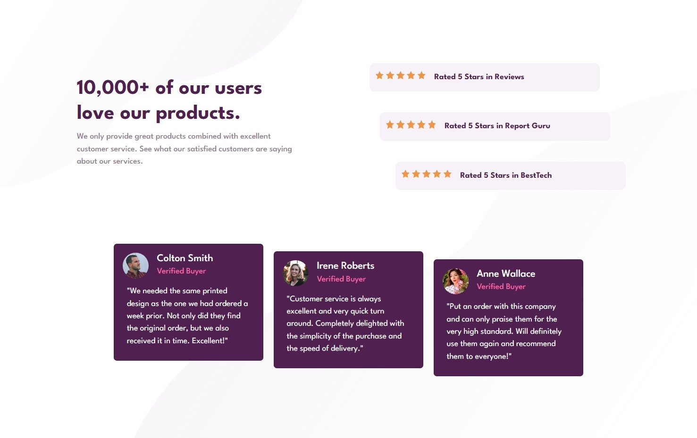
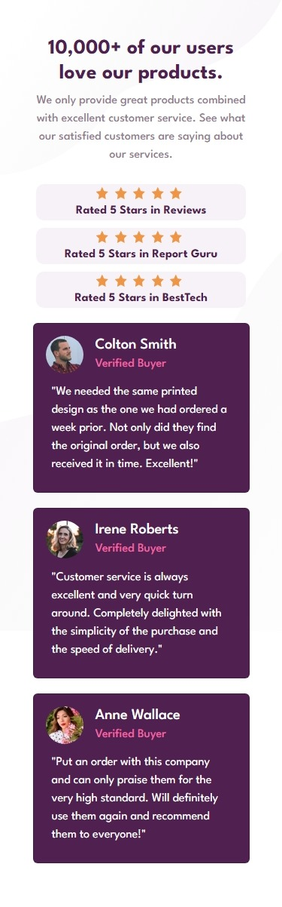

# Frontend Mentor - Social proof section solution

This is a solution to the [Social proof section challenge on Frontend Mentor](https://www.frontendmentor.io/challenges/social-proof-section-6e0qTv_bA). Frontend Mentor challenges help you improve your coding skills by building realistic projects.

## Table of contents

- [Overview](#overview)
  - [The challenge](#the-challenge)
  - [Screenshot](#screenshot)
  - [Links](#links)
- [My process](#my-process)
  - [Built with](#built-with)
  - [What I learned](#what-i-learned)
  - [Continued development](#continued-development)
  - [Useful resources](#useful-resources)
- [Author](#author)
- [Acknowledgments](#acknowledgments)

**Note: Delete this note and update the table of contents based on what sections you keep.**

## Overview

### The challenge

Users should be able to:

- View the optimal layout for the section depending on their device's screen size

### Screenshot

### Links

- Solution URL: [Solution URL here](https://github.com/ArteiusWorkshop/FM-social-proof-section-master)
- Live Site URL: [Live site URL here](https://fm-social-proof-section-master-sage.vercel.app/)

## My process

### Built with

- HTML5
- CSS custom properties
- Flexbox
- Bootstrap 5

### What I learned

Worked with grid, still working on it

### Continued development

-HTML and CSS without a framework

## Author

- Frontend Mentor - [@yourusername](https://www.frontendmentor.io/profile/ArteiusWasTaken)
